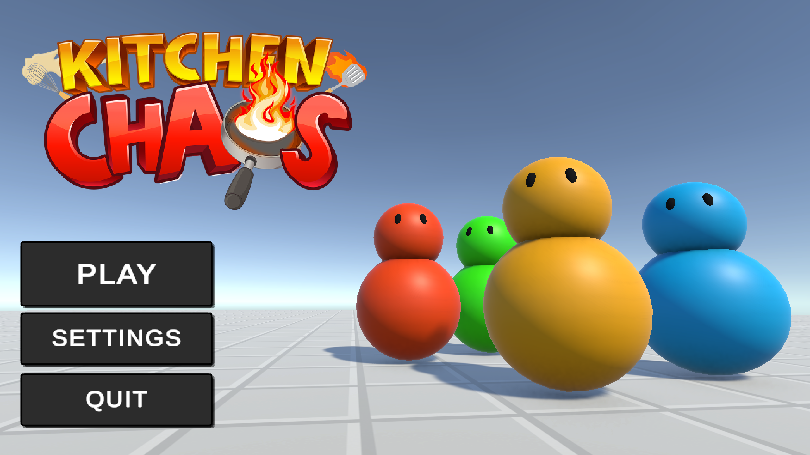

# Kitchen Chaos

An endless Kitchen Chaos where the orders never stop and it keeps getting harder.

## Play the Game
[Play Kitchen Chaos here](https://Double-stone-2.github.io/KitchenChaos/)

---

## About
Built in Unity based on Code Monkey's Kitchen Chaos tutorial, with a custom endless mode and escalating difficulty.

> Assets and sounds are from Code Monkey.

---

## How to Play

- You start with **5 lives**
- Miss or mess up a delivery and you **lose a life**
- Successfully deliver **3 recipes in a row** and you **gain a life**
- The game gets harder and harder — orders speed up and get more complex the longer you survive

---

## Controls

| Key | Action |
|---|---|
| `WASD` / Arrow Keys | Movement |
| `F` | Interact with stations (Cutting Table, Stove) |
| `E` | Pick up items (Plate, Tomato, Cheese, Bread, etc.) |
